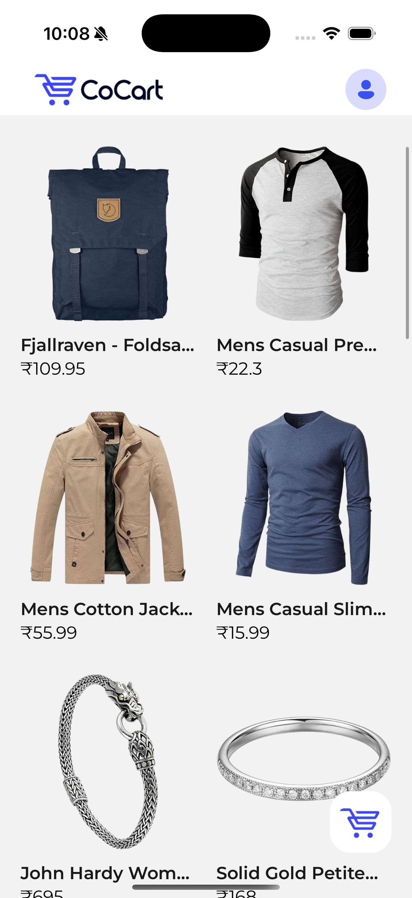
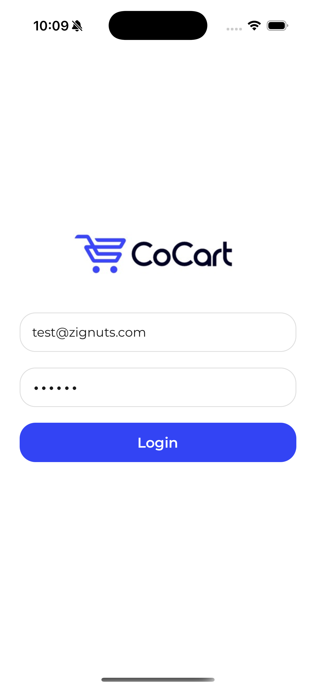
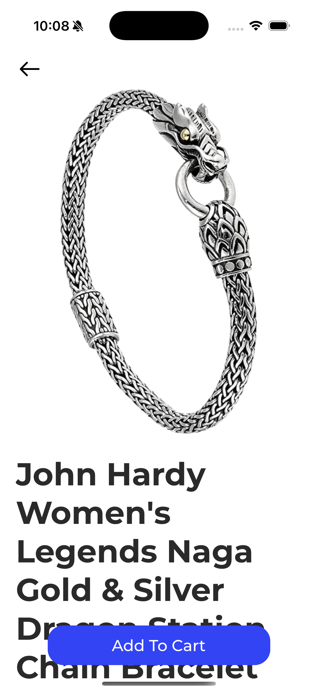
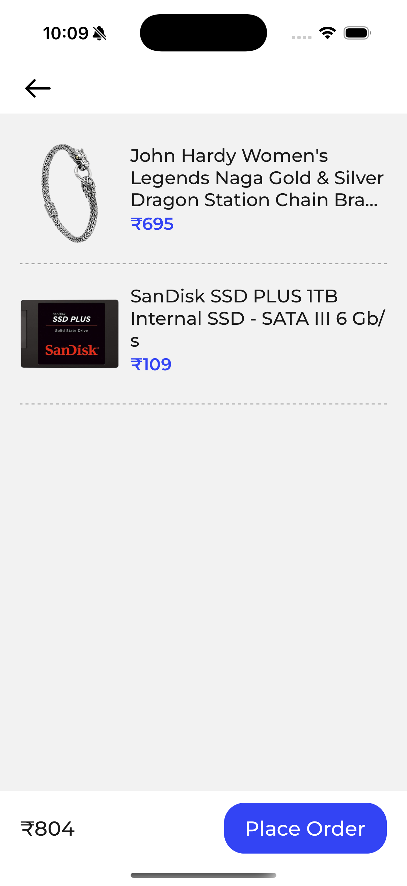
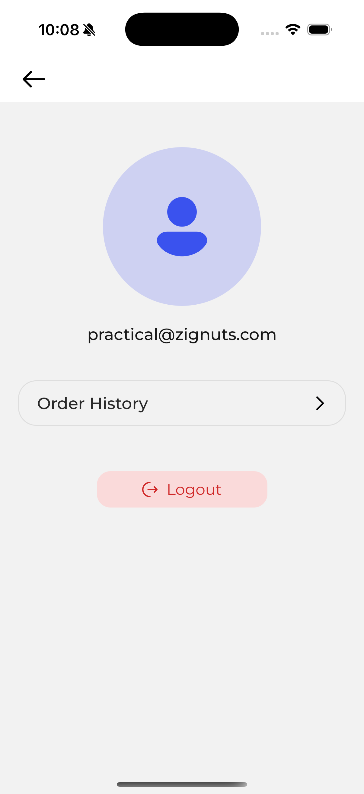

# React Native E-commerce App

## Overview

This project is a sample e-commerce mobile application built using React Native as part of a technical assignment.

## Features

- Product listing
- Product details
- Add to cart
- Order history
- Basic validations
- Clean and reusable UI components

## Tech Stack

- React Native
- JavaScript
- API integration (mock)
- State management (Redux)

## Setup Instructions

1. Clone the repository
2. Run `npm install`
3. Run `npx pod-install`
4. Run `npx react-native run-ios`

Screen Recording: https://drive.google.com/file/d/1yw-phIXcEpjSIj6BD2TkgDLh8SDmDpnX/view?usp=sharing

## Screenshots

### Home Screen

### Login

### Product Details

### Cart

### Account

### Order History

README File: Included in the repository with setup instructions, features overview, and implementation details.

The task includes:

Core e-commerce flow (product listing, product details, cart, etc.)

Clean UI with reusable components

Proper state management and API handling

Basic validations and error handling
